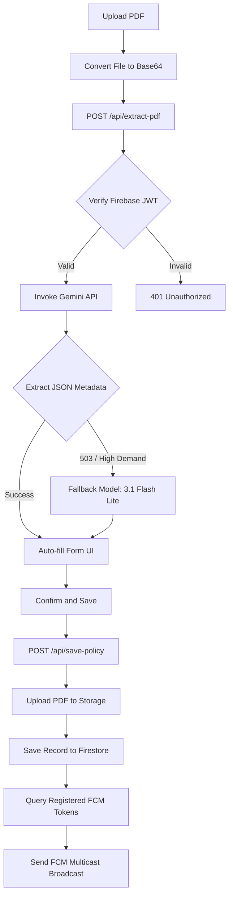

# Rokadiya Enterprise Interview Context

## 1. Executive Summary
- **What problem does the project solve?** 
  Rokadiya Enterprise solves the tedious, manual headache of tracking insurance policy expirations for vehicles and customers. In the transport and logistics sectors, missing a policy expiration date leads to lapsed insurance, heavy regulatory fines, and operational disruption. Rokadiya Enterprise automates the extraction, tracking, and notification lifecycle of insurance policies.
- **Who is the target user?**
  Transport operators, fleet managers, insurance brokers, and administrative coordinators who manage a high volume of vehicle insurance documents and need timely renewal alerts.
- **Why was it built?**
  It was built to digitize paper-based or manual spreadsheet policy workflows. Managing hundreds of expiration dates manually is highly prone to human error; this system introduces AI-driven automation to parse policies and broadcast push notifications before policies expire.
- **What makes it different from existing solutions?**
  1. **Zero-Setup AI Parsing**: Bypasses fragile PDF parser libraries by using Gemini's native multimodal capabilities (`application/pdf`) to extract fields directly from policy documents (handling masked numbers and irregular layouts).
  2. **Automated Cross-Device Push Notifications**: Leverages Firebase Cloud Messaging (FCM) to deliver instant alerts to all registered device tokens upon policy insertion and daily checks.
  3. **Robust Expiry Escalation Engine**: Implements a range-based tracking algorithm (30-day, 7-day, and expiration day triggers) driven by a secure server-side cron pipeline.
  4. **Secure Locked Diagnostic Center**: Exposes a secret-key-authenticated `/billing` console displaying real-time API quotas and console links.

---

## 2. Project Story
- **Origin of the idea & Motivation**:
  The project originated from the real-world operational challenges of Rokadiya Enterprise, where tracking vehicle fitness, insurance, and permit dates via spreadsheets led to missed renewals. The goal was to build a mobile-friendly portal where uploading a PDF policy handles the rest of the metadata lifecycle automatically.
- **Real-world problem being solved**:
  Commercial vehicles require constant compliance. Finding the actual customer phone numbers, start dates, and end dates inside multi-page PDF documents issued by various insurance carriers is slow.
- **Alternative approaches considered**:
  1. **Standard OCR/Regex Parsing (e.g., Tesseract + pdf-parse)**: Rejected because insurance companies constantly change document layouts, text sequences, and formatting. Masked mobile numbers (e.g., `xxxxxxxxx1234`) are also impossible to resolve with generic regex.
  2. **Traditional Relational Database (SQL)**: Rejected in favor of Cloud Firestore to allow rapid schemaless storage of PDF base64 backups, nested notifications state, and dynamic device tokens without database migrations.
  3. **Dedicated Mobile Application**: Rejected in favor of a progressive-style Next.js web application that can be added to the Home Screen on iOS/Android, avoiding the complexity of App Store deployments.
- **Why the final architecture was chosen**:
  Next.js 16 with Vercel hosting was chosen for full-stack deployment. This allows the frontend (React 19) and backend (Serverless Node.js API routes) to co-exist in a single repository, simplifying environment variable management and deploying serverless functions with a 60-second execution limit to handle Gemini PDF extraction.

---

## 3. High-Level Architecture

```text
[ Browser (Next.js / React 19) ] <---(HTTPS / FCM)---> [ Vercel Serverless CDN ]
             |                                                  |
             | (Bearer ID Token)                                | (Serverless API Routes)
             v                                                  v
     [ Firebase Client ]                             [ Next.js API Routes (Node.js) ]
             |                                            |              |
   (Direct Firestore SDK)                                 |              |
             v                                            |              | (Gemini SDK)
  [ Cloud Firestore (DB) ] <------------------------------┘              v
             ^                                                    [ Gemini AI Studio ]
             |                                                           |
   (FCM Tokens / Policies)                                               |
             v                                                           v
  [ Firebase Cloud Messaging ] <─────────────────────────────── [ Firebase Storage ]
                                      (PDF Binaries)
```

### Responsibility Breakdown
- **Frontend (Next.js SPA)**: Manages UI/UX, theme context (light/dark), toast messaging, and registers the PWA service worker (`firebase-messaging-sw.js`) to cache and display background notifications.
- **Backend (Next.js API Routes)**: Exposes endpoints for secure PDF extraction via Gemini, policy saving (uploading PDF binary bytes to Firebase Storage), test alerts broadcasting, and cron-based expiry checks.
- **Database (Cloud Firestore)**: Statically stores policy records (in the `policies` collection) and active push notification tokens (in the `fcmTokens` collection).
- **Storage (Firebase Storage)**: Stores raw PDF documents under the `policies/` folder prefix, serving them securely on request.
- **Queue/Timer (Vercel Crons)**: Triggers daily check-expiry tasks using server-side configurations.

### Key Flows (Step-by-Step)
#### 1. Authentication Flow
```text
User enters email/password -> Firebase Auth SDK triggers client-side sign-in ->
On successful auth, client sets a first-party "session=1" cookie ->
Subsequent page hits are evaluated in middleware (proxy.ts) using the session cookie ->
Authorized API requests fetch the user's Firebase ID token and append it as `Authorization: Bearer <JWT>` ->
Next.js API routes decode and verify the Bearer token via Firebase Admin SDK.
```

#### 2. Core PDF Ingestion & Save Pipeline
```text
User uploads PDF -> FileReader extracts base64 bytes ->
Client submits Form Data to POST /api/extract-pdf ->
API verifies Auth -> Extracts buffer -> Calls Gemini 1.5 Flash (or 3.1 Flash Lite fallback) ->
AI parses fields (Customer, Mobile, Vehicle, Dates) -> Client receives parsed fields for verification ->
User confirms -> Client POSTs to /api/save-policy ->
Backend uploads PDF to Storage bucket -> Saves policy record to Firestore ->
Backend queries registered FCM tokens -> Broadcasts multicast notification "New Policy Added" via FCM.
```

#### 3. Expiry Warning Pipeline
```text
Daily Vercel Cron triggers GET /api/cron/check-expiry -> Validates CRON_SECRET ->
Queries Firestore for all policies and FCM tokens ->
Iterates over policies and compares current date vs endDate ->
If diff <= 0 days & !notifiedOnDay -> Broadcasts "🚨 EXPIRED TODAY" -> Updates notifiedOnDay = true ->
If diff <= 7 days & !notifiedOneWeek -> Broadcasts "⚠️ URGENT Renewal" -> Updates notifiedOneWeek = true ->
If diff <= 30 days & !notifiedOneMonth -> Broadcasts "🔔 Policy Reminder" -> Updates notifiedOneMonth = true.
```

---

## 4. Complete Tech Stack

| Tier | Technology | Why Chosen | Alternatives | Tradeoffs & Benefits |
| :--- | :--- | :--- | :--- | :--- |
| **Frontend** | React 19 + TypeScript + Next.js 16 | Enables Serverless API integration, native TypeScript types, and standard client-side routing. | React SPA (Vite) | **Benefit**: Unified builds, fast setup. **Sacrifice**: Heavy Next.js bundle sizes compared to pure SPA. |
| **Styling** | Vanilla CSS + Tailwind CSS v4 | Flexible, performant styling. | CSS Modules, SASS | **Benefit**: Rapid styling using Tailwind's engine. |
| **Database** | Cloud Firestore | Document-based schemaless database that maps directly to JS/TS interfaces; natively integrates with Firebase Auth. | PostgreSQL, MongoDB | **Benefit**: Zero database maintenance, real-time client SDK hooks. **Sacrifice**: Complex analytical joins. |
| **Storage** | Firebase Storage | Managed bucket for raw document binary files. | AWS S3, local storage | **Benefit**: Free tier storage, direct security rule integration. |
| **AI Parsing** | `@google/generative-ai` | Integrates Google's Gemini models natively to parse PDFs directly. | pdf-parse + Regex | **Benefit**: Out-of-the-box multimodal reasoning. **Sacrifice**: Network latency on external API calls. |
| **Push Alerts**| Firebase Cloud Messaging (FCM) | Cross-platform push notifications that work on mobile browsers and PWAs. | Twilio SMS, Pusher | **Benefit**: Free, reliable, system-level notifications. **Sacrifice**: Needs PWA configuration on iOS. |

---

## 5. Feature Breakdown

### 1. Multimodal AI Extraction with Fallback
- **What it does**: Automatically extracts policy metadata from an uploaded PDF.
- **Internals**: Converts the file buffer to a Base64 string, calls Gemini 1.5 Flash via `@google/generative-ai` with a custom prompt, and falls back to `gemini-3.1-flash-lite` if the primary model returns a 503 error due to high demand.
- **Edge cases**: If the phone number is masked (e.g., `XXXXXX1234`), the prompt forces Gemini to ignore the primary field and scan the customer's address block or footer notes to locate an unmasked 10-digit customer number.

### 2. Double-Safeguard PDF Storage
- **What it does**: Saves the policy metadata to Firestore and the PDF to Firebase Storage.
- **Internals**: Sanitizes the customer's name to create a safe storage file path (`policies/${Date.now()}-${nameSafe}.pdf`).
- **Edge cases**: If the Firebase Storage bucket is unconfigured or upload fails, the route falls back to storing the raw Base64 document inside Firestore directly (`pdfData` field).

### 3. Progressive Warning Escalation System
- **What it does**: Daily scans policies and alerts the user at 30 days, 7 days, and on the day of expiration.
- **Internals**: Triggered by a daily cron job. It runs range evaluations and sets individual state flags (`notifiedOneMonth`, `notifiedOneWeek`, `notifiedOnDay`) to `true` upon successful FCM broadcast.
- **Edge cases**: If a cron job fails on a specific day, range-based checks (e.g., `diffDays <= 7 && diffDays > 0`) ensure the user still receives the reminder on the next day, avoiding missed warnings.

---

## 6. Database Design

### Firestore Collections & Schemas

#### 1. `policies`
- **Fields**:
  - `id` (Document ID)
  - `customerName`: String
  - `mobileNumber`: String
  - `vehicleNumber`: String
  - `startDate`: String (YYYY-MM-DD)
  - `endDate`: String (YYYY-MM-DD)
  - `pdfData`: String (Optional fallback Base64)
  - `pdfStoragePath`: String (Firebase Storage path)
  - `createdAt`: String (ISO 8601)
  - `notifiedOneMonth`: Boolean
  - `notifiedOneWeek`: Boolean
  - `notifiedOnDay`: Boolean

#### 2. `fcmTokens`
- **Fields**:
  - `id` (Document ID = User UID)
  - `token`: String (FCM Device Token)
  - `updatedAt`: String (ISO 8601)

### Relationships & Safeguards
- **1-to-1 User/Token mapping**: FCM tokens are indexed by the User's Firebase Auth `UID` to prevent duplicate token records per user account.
- **Security Rules**: Database read/write access is restricted using Firestore security rules: `allow read, write: if request.auth != null`.

---

## 7. Authentication Deep Dive

### Protocol & Flow
- **Firebase Auth**: Leverages email/password authentication via Firebase Client SDK.
- **Token Exchange**:
  1. Frontend signs in and retrieves an ID token.
  2. Frontend writes a `session=1` first-party cookie to the browser.
  3. Every API call fetches the fresh JWT via `getIdToken()` and attaches it in the header: `Authorization: Bearer <token>`.
  4. Backend decodes the JWT using the Firebase Admin SDK's `verifyIdToken()` function.

### The Middleware Proxy Solution
- Next.js looks for `middleware.ts`. In this codebase, the middleware routing is structured inside `src/proxy.ts` (acting as the edge controller for routing). It inspects the `session` cookie. If not present, it redirects pages directly to `/login`, bypassing complex API roundtrips.

---

## 8. Core Business Pipeline



---

## 9. Version Control / Storage Model
- **Blob Prefixing**: Instead of complex file revision systems or Git trees, the app stores PDFs in Firebase Storage using a timestamped prefix system (`policies/${Date.now()}-${nameSafe}.pdf`).
- **Why this scales**: Offloads storage disk requirements from serverless backend functions to Firebase's CDN storage infrastructure, ensuring zero local disk footprints.

---

## 10. Infrastructure & Deployment
- **Hosting**:
  - **Next.js & APIs**: Vercel Serverless.
  - **Database & Storage**: Google Firebase.
- **Cron Server**: Managed via `vercel.json` crons scheduler. Runs `/api/cron/check-expiry` at `0 3 * * *` (3 AM UTC / 8:30 AM IST).
- **Environment Management**: Crucial credentials (like `FIREBASE_PRIVATE_KEY` and `GEMINI_API_KEY`) are stored as Vercel Environment Variables. The private key string formatting handles escaped newlines programmatically: `privateKey.replace(/\\n/g, "\n")`.

---

## 11. Major Problems Faced During Development

### 1. Masked Phone Numbers in PDFs
- **Symptom**: Auto-filled customer mobile numbers were populated as masked text (e.g., `XXXXXX9988`), which broke the alert lookup system.
- **Root Cause**: Insurance providers redact numbers in the explicit "Mobile Number" table field for security reasons.
- **Final Fix**: Rewrote the extraction prompt to instruct Gemini to perform a deep scan of the address block, footer notes, and reference sections to find the actual unmasked 10-digit customer number.

### 2. Service Worker VAPID Key Mismatch
- **Symptom**: Push notifications registered fine in local dev mode but crashed with "Registration failed" in production.
- **Root Cause**: The service worker registration was missing the correct `vapidKey` configuration, causing FCM subscription handshakes to fail.
- **Final Fix**: Passed `process.env.NEXT_PUBLIC_FIREBASE_VAPID_KEY` explicitly during the `getToken()` registration call in [NotificationManager.tsx](file:///d:/Project/Rokadiya%20enterprise/app/src/components/NotificationManager.tsx#L30-L33).

### 3. Local Build Crash via Firebase Config Env Vars
- **Symptom**: Production build (`npm run build`) failed during static analysis compilation.
- **Root Cause**: Firebase Client SDK initialization crashed during Next.js build because environment variables were undefined on the build server.
- **Final Fix**: Added a guard condition in [firebase.ts](file:///d:/Project/Rokadiya%20enterprise/app/src/lib/firebase.ts#L16-L26) to prevent initialization if `apiKey` is undefined, returning `null` exports gracefully.

---

## 12. Security Considerations
- **Content Security Policy (CSP)**: Highly detailed CSP headers are configured in [next.config.ts](file:///d:/Project/Rokadiya%20enterprise/app/next.config.ts) and [vercel.json](file:///d:/Project/Rokadiya%20enterprise/app/vercel.json) to restrict connections exclusively to Google APIs and Firebase hosts.
- **Access Restriction for Diagnoses**: The `/billing` details page is locked behind a custom query key matching `NEXT_PUBLIC_BILLING_KEY` to prevent exposure of system console URLs.
- **CORS Constraints**: API endpoints reject cross-origin requests by validating origins against the configured app domain.

---

## 13. Performance Considerations
- **Stand-alone Serverless execution**: Next.js is configured with `output: "standalone"` to keep deployment sizes to a minimum.
- **Lazy imports**: Heavy packages like `firebase-admin/storage` are imported dynamically inside API handlers only when a PDF payload is present, reducing initial cold-start times.

---

## 14. Design Decisions

### 1. Client-Side Firestore SDK vs Server API Writes
- **Decision**: Directly read collection records on the client using the Firebase SDK, but perform modifications and uploads via API routes.
- **Why**: Speeds up list rendering and search query filtering via client-side caching, while keeping heavy PDF saving and push broadcasts secured on the server.

### 2. Dynamic Model Fallback for Extractor
- **Decision**: Primary extraction executes on `gemini-1.5-flash` but automatically redirects requests to `gemini-3.1-flash-lite` on 503 errors.
- **Why**: Guarantees PDF ingestion processing continues uninterrupted even during peak traffic times on Google's free-tier APIs.

### 3. Vercel Cron Scheduling
- **Decision**: Runs checks at 3:00 AM UTC (8:30 AM IST).
- **Why**: Ensures alerts arrive on user devices early in the working morning without needing a persistent background server process.

---

## 15. Resume Talking Points

### 30-Second Elevator Pitch
> "I developed Rokadiya Enterprise, an AI-driven compliance portal built on Next.js 16 and Firebase. It eliminates the manual tracking of vehicle insurance expirations by allowing operators to drop a policy PDF, automatically parsing dates and masked contact info using Google Gemini, and setting up automated push reminders via Firebase Cloud Messaging."

### 1-Minute Explanation
> "I built a full-stack Next.js app to manage compliance policies. The system uses a client-side React UI that takes PDF files, extracts their binary contents, and sends them to a Node.js API route. The backend runs multimodal analysis using Gemini to extract customer information and dates, falling back to flash-lite models if API limits are hit. Validated data is committed to Firestore while the PDF is saved to Firebase Storage. Finally, a Vercel cron triggers a daily evaluation script that checks expiration deadlines and uses Firebase Cloud Messaging to send alerts directly to all registered admin devices."

### 2-Minute Explanation
> "In Rokadiya Enterprise, my primary goal was to automate document ingestion and notifications. On the frontend, I integrated a custom Next.js middleware using cookie-based auth validation to secure routes. For ingestion, I built an API endpoint that handles Base64 data, passes it to the Gemini SDK, and maps the structured JSON back to an editable client form. To support cross-platform alerts, I registered service worker event listeners that save device tokens directly to Firestore. I also implemented a daily cron-based reminder engine that tracks expiry thresholds. To ensure security, I enforced strict database access control rules and set up tight CSP headers in `next.config.ts`, ensuring the application remains locked down and highly performant."
